# Instructions

Below is a short description of how to setup this bot.

1. Create a Facebook page for this bot unless you already have one you want to associate to this bot. https://www.facebook.com/pages/creation/
2. Create a Facebook app at https://developers.facebook.com 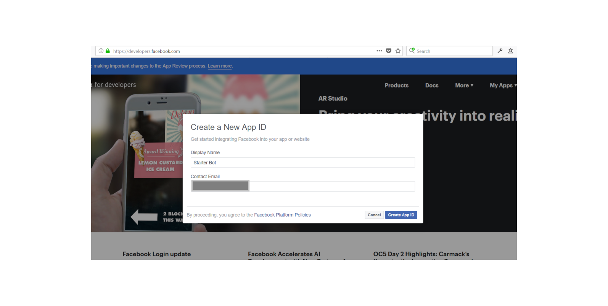
3. On the Facebook app page, click setup messenger. 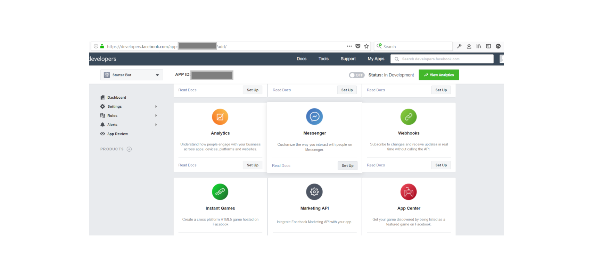 Then scroll down to Token Generation.  Select the Facebook page you would like to associate to this Facebook app, go through the confirmation process until you get the FB_PAGE_ACCESS_TOKEN.  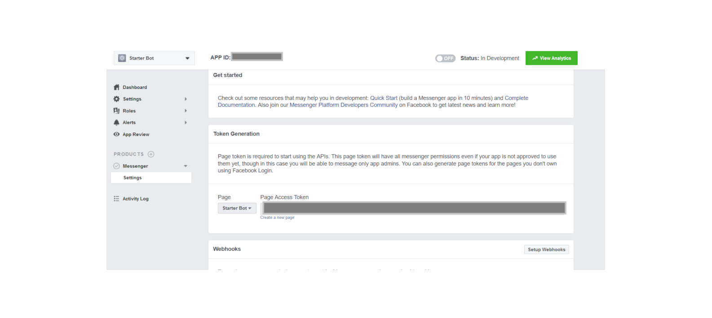
4. Either go to https://console.cloud.google.com/home/dashboard and select an existing GCP project or create a new GCP project https://console.cloud.google.com/projectcreate.  Whichever option you choose, the project does need a billing account attached to it even if you use the free tier: https://console.cloud.google.com/billing
5. Then go to https://console.cloud.google.com/google/maps-apis/new?project=<GCP_ProjectID> and enable the appropriate Maps APIs.  For this project we will be using:

        a. Places API
        b. Maps Elevation API
        c. Roads API
        d. Maps Static API
        e. Time Zone API
        f. Geocoding API
    There are other APIs that are not implemented in this project but you could find useful.  Some APIs are only available with a Premium plan.  For more information please check out: https://github.com/googlemaps/google-maps-services-js.
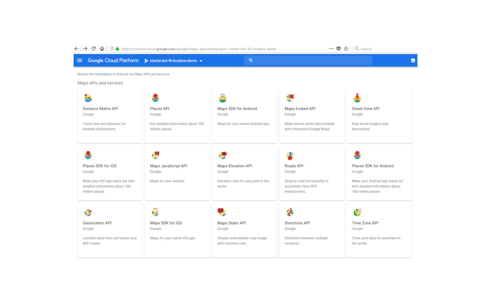
6. Now select "Credentials", then "Create Credentials", and finally select "API key". 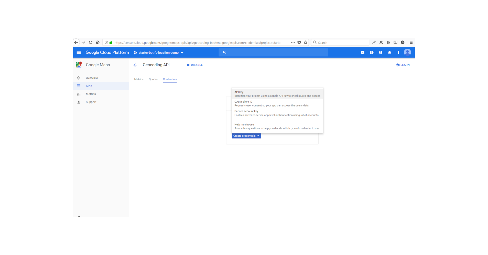
This will return your GOOGLE_MAPS_KEY. We do not add any restrictions for the API key and is highly recommended that you do this before going into production. 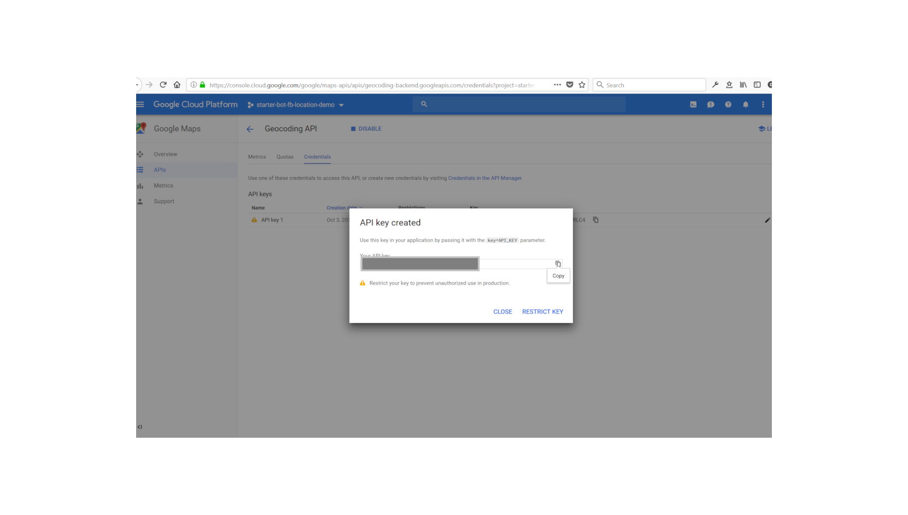
7. Add the FB_PAGE_ACCESS_TOKEN and GOOGLE_MAPS_KEY tokens to the parameters.  You will need to make up the FB_VERIFICATION_BOT_TOKEN such as "IAmGro0t" (just don't make it this easy) and add this as the final parameter.  Hit deploy.

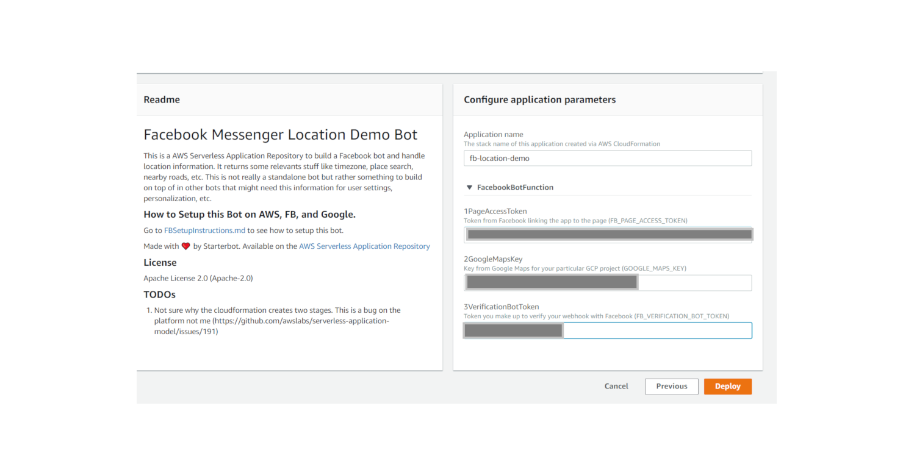
8. Click on "View Cloudformation stack" 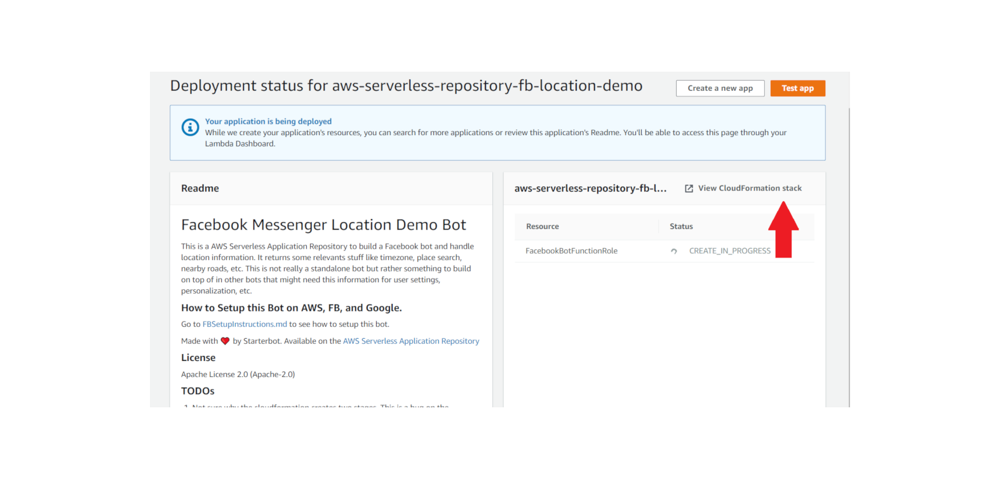 Then look at the output which will have the url for the API.  This takes about 3 minutes to generate. 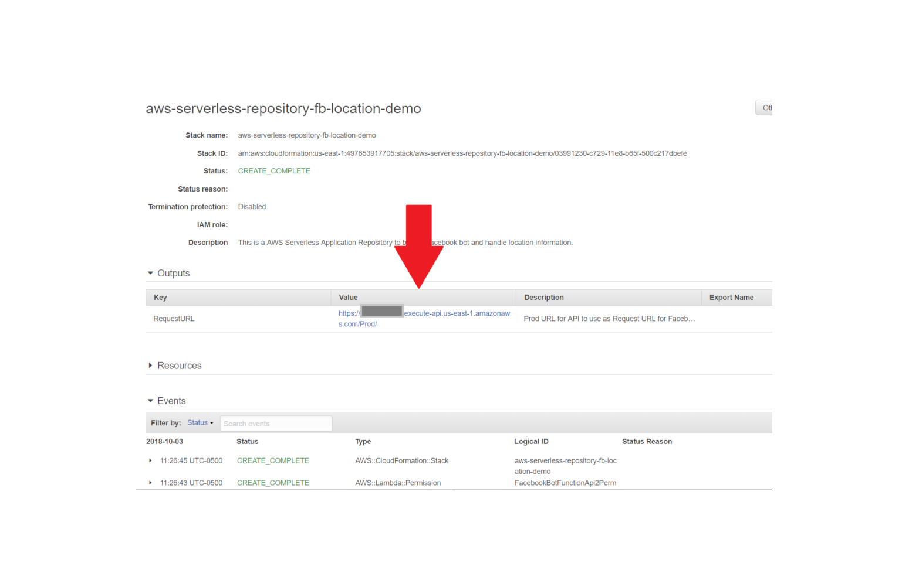
9. Go to your Facebook app and select "Setup Webhooks". 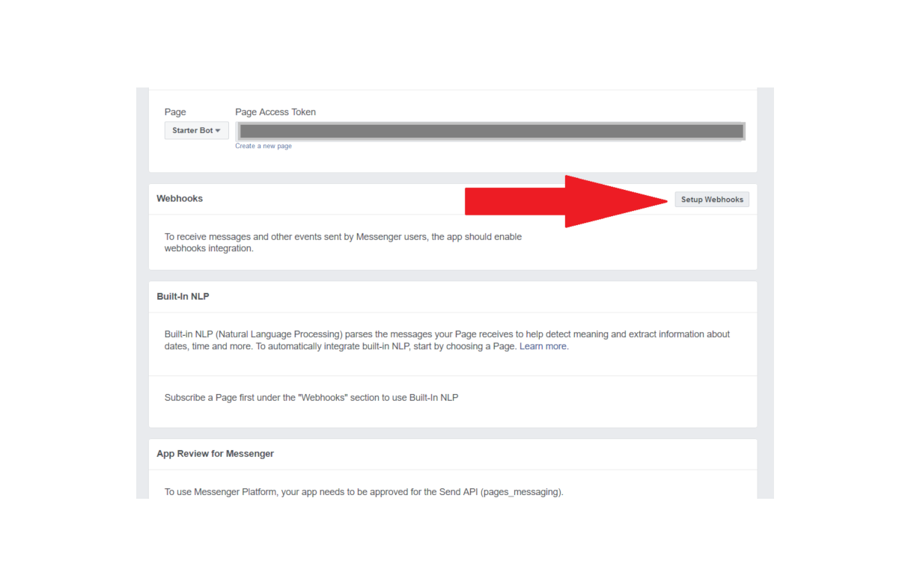

Paste this API url, the FB_VERIFICATION_BOT_TOKEN you made up, check these boxes: 

        a. messages
        b. messaging_postbacks
        c. messaging_optins
        d. message_deliveries

and hit "Verify and Save".
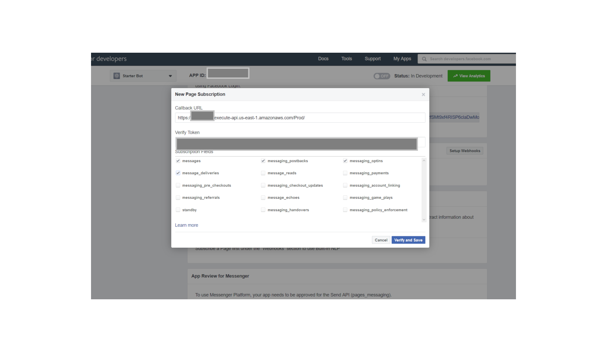
10. After the webhook is set, select your page for the webhook subscription and hit "Subscribe". 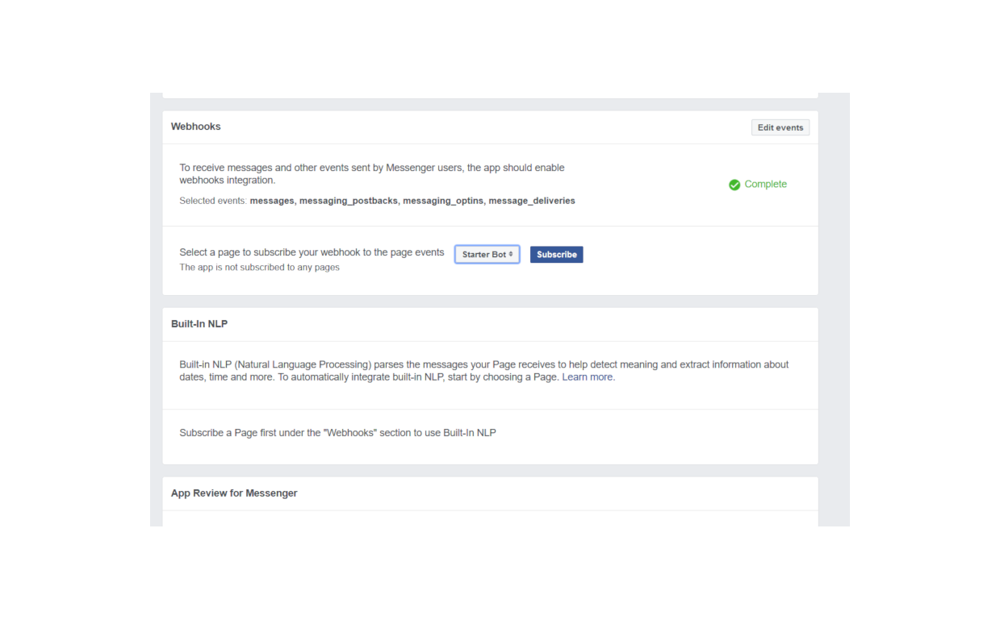

11. Congrats, you should have a fully functional bot that is associated to your Facebook Page!!  You can either select "View as Page Visitor" on your Facebook Page and chat with your bot there 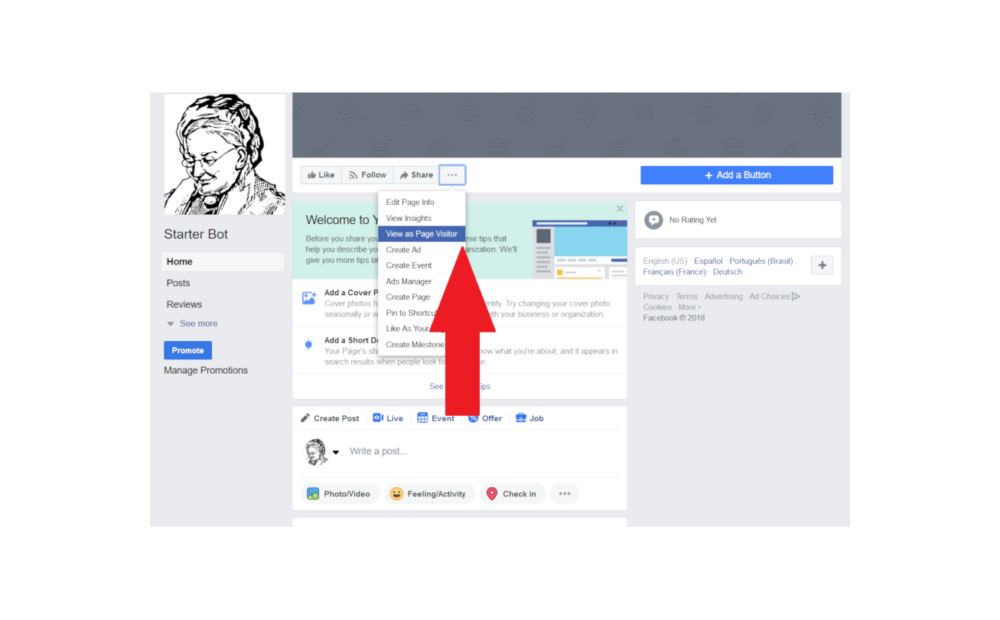 Alternatively you can go to https://www.messenger.com/t/<FB_PAGE_ID> and test your bot. 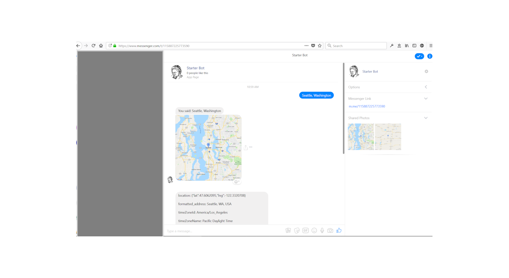

It is possible this may not work solely due to my directions (I wrote this really fast).  If it does not work, you have three options: try to figure out what step I accidentally omitted from these directions, message me and I will try to help the best I can, or give up and set your laptop on fire (it should be noted I am not responsible for any damage these directions may cause).

There are some optional things you can setup that can be found here [FBOptionalSetup.md](https://github.com/starterbot/fb-location-demo/blob/master/FBOptionalSetup.md)